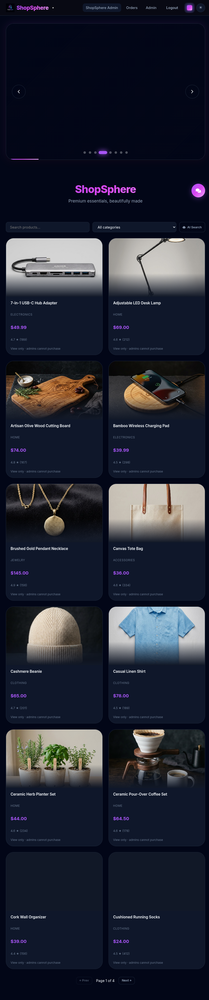
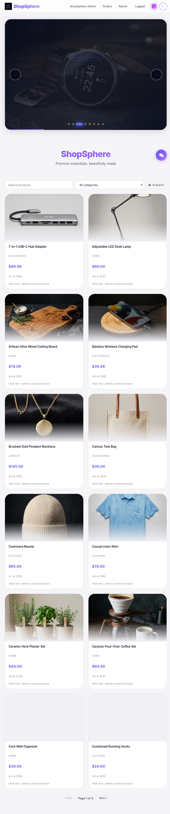
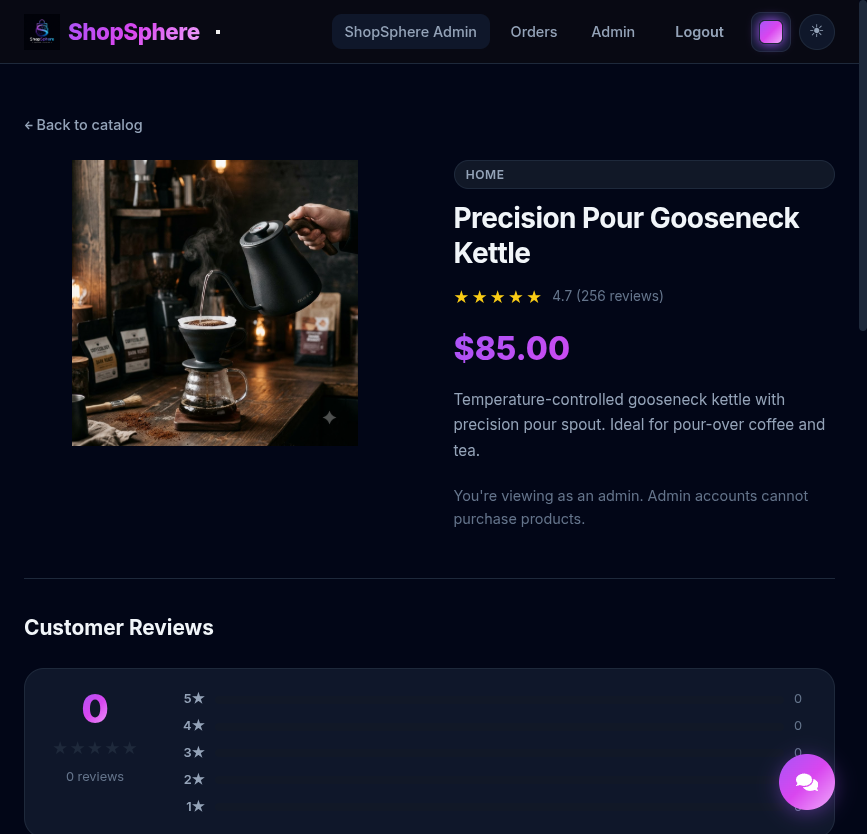
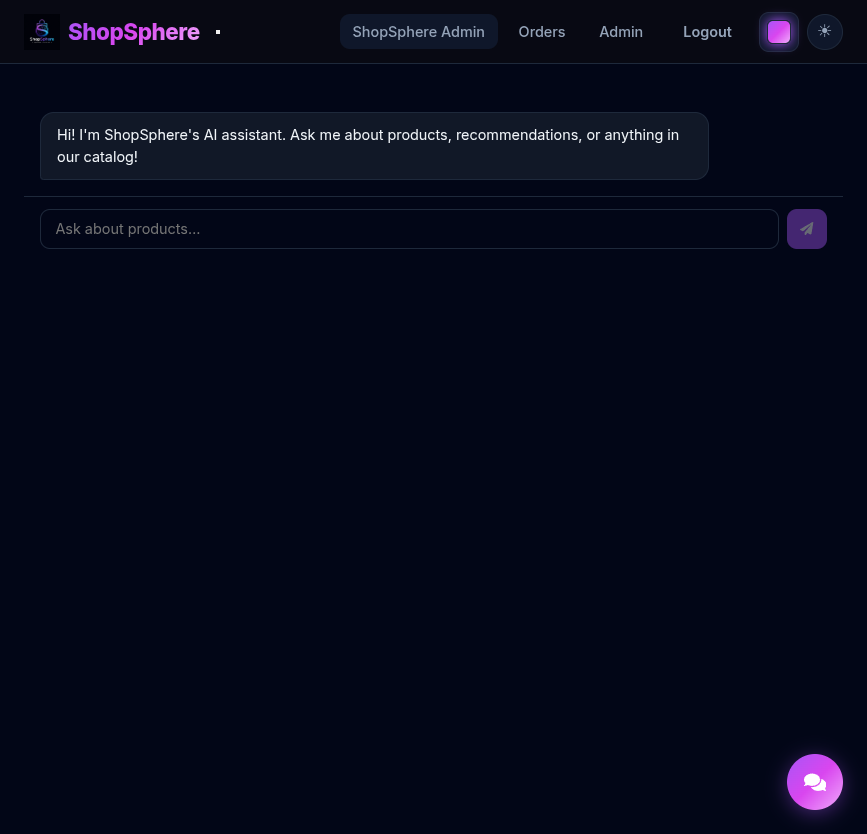
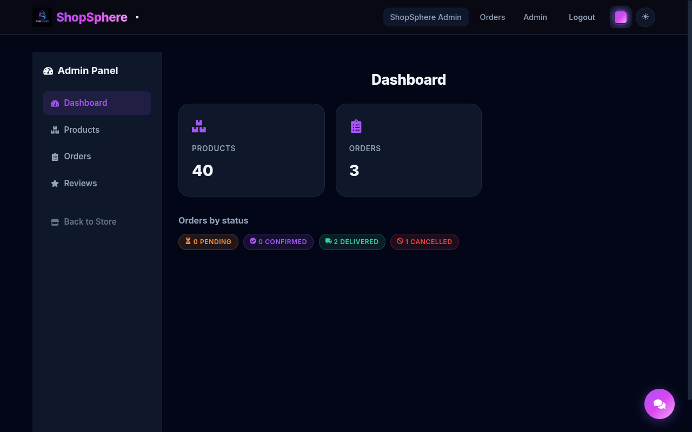
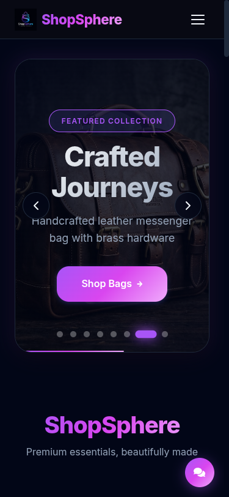
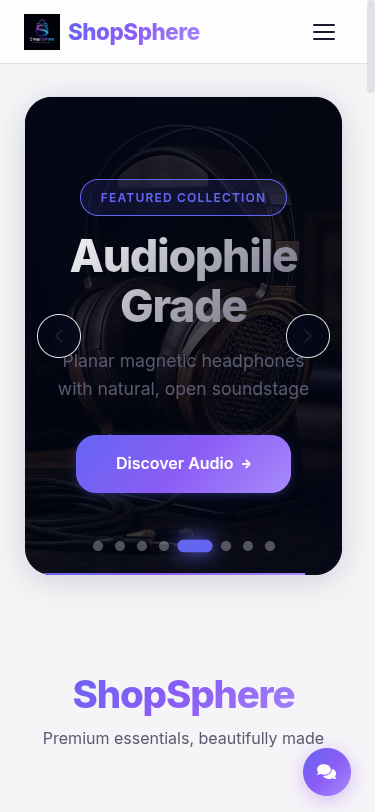

<div align="center">

# 🛍️ ShopSphere

**A production-quality e-commerce platform with AI-powered shopping assistant**


[Live Demo](https://shopsphere-phi-nine.vercel.app) • [Report Bug](https://github.com/amiitdev/shopsphere/issues) • [Request Feature](https://github.com/amiitdev/shopsphere/issues)

</div>

---

## 📸 Screenshots

### Home Page — Dark Theme


### Home Page — Light Theme


### Product Detail


### AI Shopping Assistant


### Admin Dashboard


### Mobile Responsive
| Dark Theme | Light Theme |
|:---:|:---:|
|  |  |

---

## ✨ Features

### 🤖 AI-Powered Shopping Assistant
- **Chatbot** — Natural language product search with beautiful card responses
- **Semantic Search** — "Something for a cold morning" → relevant products
- **Sentiment Analysis** — Analyze review tone and themes
- **Recommendations** — "You Might Also Like" on every product page

### 🛒 E-Commerce Core
- Product catalog with 40 AI-generated product images
- Shopping cart with persistent state
- Checkout flow with simulated payment
- Order history and tracking
- Pagination with 12 products per page

### 👤 Authentication & Authorization
- Email + password signup/login with bcrypt
- JWT tokens in httpOnly cookies (XSS-proof)
- Admin role with protected routes
- Admin lockout from buying features

### 🔧 Admin Panel
- Dashboard with sales analytics
- Product CRUD with image upload (5MB limit)
- Order management with status updates
- Review moderation

### 💬 User Reviews
- Star ratings with breakdown bars
- Write reviews (verified-purchase gated)
- Admin moderation queue

### 🎨 UI/UX
- Dark theme by default with light toggle
- Responsive design (mobile → desktop)
- Animated toasts and notifications
- AI chat with full-screen page

---

## 🏗️ Architecture

```
shopsphere/
├── backend/                 # Express + TypeScript API
│   ├── src/
│   │   ├── controllers/     # Route handlers
│   │   ├── middleware/       # Auth, upload, error handling
│   │   ├── models/          # Mongoose schemas (Product, User, Order, Review, Cart)
│   │   ├── routes/          # API routes
│   │   ├── services/        # Business logic + AI integration
│   │   ├── seed.ts          # Database seeder (40 products)
│   │   └── index.ts         # Server entry
│   └── tests/               # Backend tests (60+)
├── frontend/                # React + Vite + TypeScript
│   ├── src/
│   │   ├── components/      # Reusable UI components
│   │   ├── pages/           # Route pages
│   │   ├── pages/admin/     # Admin panel pages
│   │   ├── api.ts           # API client functions
│   │   └── App.tsx          # Router setup
│   └── tests/               # Frontend tests
└── docs/                    # ADRs, security reviews, screenshots
```

---

## 🚀 Quick Start

### Prerequisites
- **Node.js** 18+ 
- **MongoDB** running locally (or Atlas URI)
- **Gemini API key** from [Google AI Studio](https://aistudio.google.com/apikey)

### 1. Clone & Install

```bash
git clone https://github.com/amiitdev/shopsphere.git
cd shopsphere

# Install dependencies
cd backend && npm install
cd ../frontend && npm install
cd ..
```

### 2. Configure Environment

```bash
# Backend
cp backend/.env.example backend/.env
# Edit backend/.env with your values:
#   MONGODB_URI=mongodb://127.0.0.1:27017/shopsphere
#   AUTH_SECRET=your-secret-key
#   GEMINI_API_KEY=your-gemini-api-key
```

### 3. Seed Database

```bash
cd backend
npm run seed
# Populates 40 products with AI-generated images
```

### 4. Run Development Servers

```bash
# Terminal 1 - Backend (port 4000)
cd backend
npm run dev

# Terminal 2 - Frontend (port 5173)
cd frontend
npm run dev
```

### 5. Open Browser

```
http://localhost:5173
```

---

## 🔑 User Registration

| Action | How |
|--------|-----|
| Create account | Register via `/signup` |
| Admin access | Create account, then update role in MongoDB |

---

## 📡 API Endpoints

### Products
| Method | Endpoint | Description |
|--------|----------|-------------|
| GET | `/api/products` | List products (supports `?search=`, `?page=`, `?limit=`) |
| GET | `/api/products/:id` | Get product by ID |
| GET | `/api/products/categories` | List categories |

### Auth
| Method | Endpoint | Description |
|--------|----------|-------------|
| POST | `/api/auth/signup` | Register new user |
| POST | `/api/auth/login` | Login |
| POST | `/api/auth/logout` | Logout |
| GET | `/api/auth/me` | Get current user |

### Cart & Orders
| Method | Endpoint | Description |
|--------|----------|-------------|
| GET | `/api/cart` | Get cart |
| POST | `/api/cart` | Add to cart |
| PATCH | `/api/cart/:id` | Update quantity |
| DELETE | `/api/cart/:id` | Remove from cart |
| POST | `/api/checkout` | Place order |
| GET | `/api/orders` | Get user orders |

### Reviews
| Method | Endpoint | Description |
|--------|----------|-------------|
| GET | `/api/products/:id/reviews` | Get product reviews |
| POST | `/api/products/:id/reviews` | Submit review |

### AI Features
| Method | Endpoint | Description |
|--------|----------|-------------|
| POST | `/api/ai/chat` | Chat with AI assistant |
| POST | `/api/ai/search` | Semantic product search |
| POST | `/api/ai/sentiment` | Analyze review sentiment |
| GET | `/api/ai/recommendations/:id` | Get product recommendations |

### Admin
| Method | Endpoint | Description |
|--------|----------|-------------|
| GET | `/api/admin/products` | List all products |
| POST | `/api/admin/products` | Create product |
| PUT | `/api/admin/products/:id` | Update product |
| DELETE | `/api/admin/products/:id` | Delete product |
| POST | `/api/admin/upload` | Upload product image |
| GET | `/api/admin/orders` | List all orders |
| PATCH | `/api/admin/orders/:id` | Update order status |
| GET | `/api/admin/reviews` | List all reviews |
| PATCH | `/api/admin/reviews/:id/approve` | Approve review |
| PATCH | `/api/admin/reviews/:id/reject` | Reject review |

---

## 🧪 Testing

```bash
# Backend tests (isolated test DB)
cd backend
npm run test

# Frontend tests
cd frontend
npm run test

# Type checking
cd backend && npm run typecheck
cd frontend && npm run typecheck
```

---

## 🛠️ Tech Stack

| Layer | Technology |
|-------|------------|
| **Frontend** | React 18, TypeScript, Vite, React Router |
| **Backend** | Express, TypeScript, Node.js |
| **Database** | MongoDB with Mongoose |
| **AI** | Google Gemini 2.5 Flash |
| **Auth** | JWT + httpOnly cookies + bcrypt |
| **Testing** | Vitest (frontend), Node test runner + supertest (backend) |
| **Styling** | CSS custom properties, dark theme |
| **Image Gen** | Google Flow (nano-banana-2 model) |

---

## 📦 Environment Variables

```env
# Backend (.env)
MONGODB_URI=mongodb://127.0.0.1:27017/shopsphere
AUTH_SECRET=your-jwt-secret
GEMINI_API_KEY=your-gemini-api-key
GEMINI_MODEL=gemini-2.5-flash
PORT=4000
CORS_ORIGIN=http://localhost:5173
```

---

## 🌐 Production

- **Frontend**: [https://shopsphere-phi-nine.vercel.app](https://shopsphere-phi-nine.vercel.app)
- **Backend API**: [https://shopsphere-api-two.vercel.app](https://shopsphere-api-two.vercel.app)

---

## 🤝 Contributing

1. Fork the repository
2. Create your feature branch (`git checkout -b feature/amazing-feature`)
3. Commit your changes (`git commit -m 'Add amazing feature'`)
4. Push to the branch (`git push origin feature/amazing-feature`)
5. Open a Pull Request

---

## 📄 License

This project is licensed under the MIT License.

---

<div align="center">

**Built with ❤️ using React, Express, MongoDB & Gemini AI**

</div>
